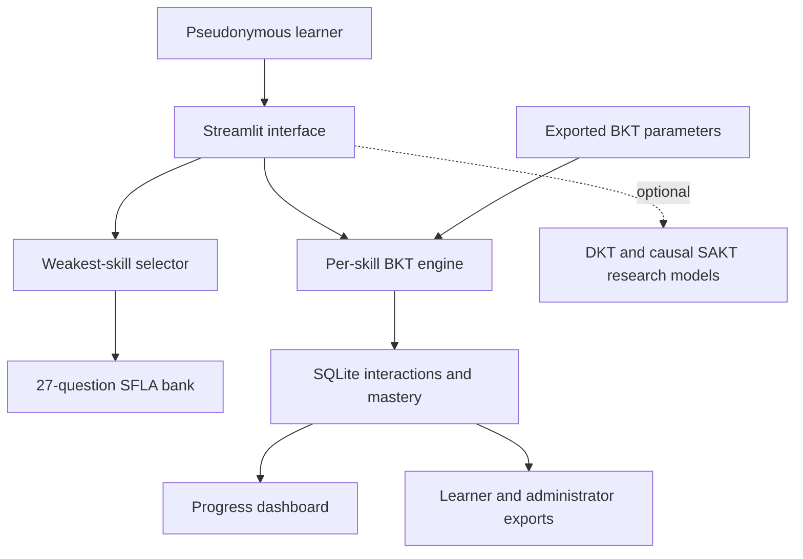

# SFLA Adaptive Learning Platform

A Streamlit proof-of-concept for adaptive practice in **Sets, Functions and Linear Algebra (SFLA)**.

[Open the hosted application](https://sfla-adaptive-learning.streamlit.app/) · [Return to the repository README](../README.md)

> **Research boundary:** the SFLA learner interactions and fitted model parameters are simulated. The platform demonstrates technical operation and cross-domain configurability; it is not a validated learning intervention and its recommendations should not be treated as educational advice.

## What the platform does

The application maintains a separate Bayesian Knowledge Tracing (BKT) mastery estimate for each of nine knowledge components. It prioritises the learner's weakest available skill, selects a difficulty from the current mastery estimate, presents immediate feedback, updates mastery after the response, and stores the interaction in SQLite.

The interface contains four tabs:

| Tab | Purpose |
|---|---|
| **Learning session** | Presents adaptive questions, records answers, explains the correct response, and displays the BKT update |
| **Learner progress** | Shows current mastery, attempted questions, accuracy, the recommended topic, mastery trajectories, and recent interactions |
| **Research export** | Previews and downloads learner-scoped interactions, mastery states, an export manifest, and model-disagreement data |
| **About** | Explains model roles, parameter provenance, privacy, and storage limitations |

Additional functionality includes:

- manual pseudonymous learner IDs or automatically generated anonymous demo IDs;
- session-level summaries and downloads;
- persistent mastery across sessions for the same pseudonymous learner;
- an optional DKT and causal SAKT research-prediction display;
- password-protected application-wide exports for an administrator;
- automated unit tests and an integrated functional-evaluation scorecard.

Note: Generative AI was used to support the creation of the question bank by generating questions aligned with the defined knowledge components and difficulty levels, with all questions reviewed and refined for accuracy and suitability before inclusion.

## Adaptive logic

### Question selection

1. Order skills from lowest to highest current mastery.
2. Select the lowest-mastery skill that still has an unattempted question.
3. Choose the target difficulty from the mastery thresholds below.
4. Prefer a question at that difficulty; if none is available, use another unattempted question for the same skill.
5. Do not repeat an item during the current question cycle.

| Current mastery | Target difficulty |
|---:|---|
| Below 0.40 | Easy |
| 0.40 to below 0.70 | Medium |
| 0.70 or above | Hard |

After all available items have been attempted, the learner can restart the question cycle.

### Model roles

| Model | Platform role | Controls recommendations? |
|---|---|---:|
| BKT | Predicts correctness, updates per-skill mastery, and drives adaptation | Yes |
| DKT | Optional next-response probability for research comparison | No |
| Causal SAKT | Optional next-response probability for research comparison | No |

The optional neural predictions use completed interaction history only. The current question's response is never included, and at least one completed interaction is required before DKT and SAKT can return a prediction.

## Knowledge components and question bank

The committed question bank contains 27 original prototype practice questions: one easy, one medium, and one hard item for each knowledge component.

| Skill | Knowledge component |
|---|---|
| KC01 | Logical equivalence and truth tables |
| KC02 | Quantifiers and statement transformations |
| KC03 | Set notation and membership |
| KC04 | Set operations |
| KC05 | Power sets and Cartesian products |
| KC06 | Set-based proof |
| KC07 | Mathematical induction |
| KC08 | Function properties |
| KC09 | Inverse and composite functions |

The questions are prototype content and are not an official UWE assessment bank.

## Architecture



## Required artefacts

Run the application from the repository checkout so these relative paths resolve correctly:

| Artefact | Path | Requirement |
|---|---|---|
| Question bank | [`data/platform/sfla_question_bank.csv`](../data/platform/sfla_question_bank.csv) | Required |
| Item register | [`data/processed/SFLA_Item_Register_v1.xlsx`](../data/processed/SFLA_Item_Register_v1.xlsx) | Required |
| Per-skill BKT parameters | [`models/sfla/sfla_bkt_parameters.json`](../models/sfla/sfla_bkt_parameters.json) | Required |
| Neural-model metadata | [`models/sfla/sfla_neural_metadata.json`](../models/sfla/sfla_neural_metadata.json) | Optional research predictions |
| DKT SavedModel | [`models/sfla/sfla_dkt_savedmodel/`](../models/sfla/sfla_dkt_savedmodel/) | Optional research predictions |
| SAKT SavedModel | [`models/sfla/sfla_sakt_savedmodel/`](../models/sfla/sfla_sakt_savedmodel/) | Optional research predictions |

If the optional neural artefacts cannot be loaded or their TensorFlow version does not match the metadata, the BKT application remains operational and reports that the research predictions are unavailable.

## Run locally

From the repository root, using Python 3.12:

```bash
python3 -m venv .venv
source .venv/bin/activate
python -m pip install --upgrade pip
python -m pip install -r adaptive_learning_platform/requirements.txt
python -m streamlit run adaptive_learning_platform/app.py
```

On Windows PowerShell:

```powershell
.venv\Scripts\Activate.ps1
python -m pip install --upgrade pip
python -m pip install -r adaptive_learning_platform/requirements.txt
python -m streamlit run adaptive_learning_platform/app.py
```

Streamlit normally opens `http://localhost:8501` automatically.

## Configuration and storage

### Administrator export password

The standard export is restricted to the active pseudonymous learner. To enable the all-learner administrator export locally, create `.streamlit/secrets.toml` in the repository root with:

```toml
SFLA_ADMIN_PASSWORD = "replace-with-a-strong-password"
```

Do not commit this file. It is already excluded by `.gitignore`. On Streamlit Community Cloud, add the same setting through the application's Secrets configuration.

### SQLite database

The application creates its database automatically at:

```text
adaptive_learning_platform/storage/sfla_learning.db
```

The database stores interaction records and the latest mastery value for every learner-skill pair. Local database files are excluded from version control.

On Streamlit Community Cloud, local SQLite data can be lost when the application sleeps, restarts, or is redeployed. Use a managed persistent database and an approved retention process before any real participant study.

## Research exports

The active learner can download:

- interaction records as CSV;
- current mastery states as CSV;
- a JSON export manifest;
- a strict like-for-like BKT/DKT/SAKT disagreement table as CSV when all three predictions are available.

The administrator export provides the corresponding application-wide files only after the configured password has been entered. The password unlock applies only to the current browser session.

## Tests and functional evaluation

From the repository root, install the platform requirements and run:

```bash
python -m pytest adaptive_learning_platform/tests
```

The tests cover:

- BKT probability and mastery updates;
- question-bank schema, duplicate, skill, and difficulty validation;
- learner mastery initialisation and persistence;
- learner-scoped, session-scoped, and administrator export queries;
- weakest-skill selection, difficulty selection, and question-cycle behaviour.

Run the integrated functional evaluation with:

```bash
python adaptive_learning_platform/scripts/run_platform_evaluation.py
```

This refreshes:

- [`results/adaptive_platform/platform_functional_scorecard.csv`](../results/adaptive_platform/platform_functional_scorecard.csv)
- [`results/adaptive_platform/platform_functional_summary.json`](../results/adaptive_platform/platform_functional_summary.json)

The committed summary records 11 passed checks, 0 warnings, and 0 failures.

To rebuild the prototype question bank:

```bash
python adaptive_learning_platform/scripts/create_question_bank.py
```

## Deploy on Streamlit Community Cloud

1. Push the repository to GitHub.
2. Create a Streamlit Community Cloud application from the repository.
3. Set the main file path to `adaptive_learning_platform/app.py`.
4. Keep `adaptive_learning_platform/requirements.txt` beside the application entry point.
5. Add `SFLA_ADMIN_PASSWORD` in the Streamlit Secrets settings only if administrator export is required.
6. Deploy and confirm that the question bank, item register, and model artefacts load successfully.

The current public deployment is available at [sfla-adaptive-learning.streamlit.app](https://sfla-adaptive-learning.streamlit.app/).

## Privacy and responsible use

- Use study codes or invented identifiers only.
- Do not enter names, email addresses, student numbers, or other personal identifiers.
- Do not use the hosted demonstration to collect sensitive learner data.
- Standard downloads are intentionally scoped to the active learner.
- Application-wide downloads require the administrator password.
- Participant information, consent, retention, deletion, and security arrangements are required before a real learner study.

## Limitations

- BKT, DKT, and SAKT artefacts for SFLA were fitted or evaluated with simulated responses.
- The model outputs establish execution, not target-domain predictive validity.
- The application has not been evaluated for learning effectiveness, usability, fairness, or accessibility with real learners.
- The 27-item bank is intentionally small and supports a prototype question cycle rather than a complete course assessment system.
- The cross-domain evidence covers logic, sets, proof, and functions; the source assessment material did not provide eligible linear-algebra items.
- SQLite and a shared administrator password are appropriate only for a controlled prototype, not production deployment.

## Troubleshooting

| Problem | Check |
|---|---|
| Question bank or item register not found | Confirm that the required committed artefact paths above exist and have not been renamed |
| DKT and SAKT are unavailable | Install TensorFlow 2.21.0 and confirm the SavedModels and neural metadata are present |
| TensorFlow version mismatch | Use the version in `adaptive_learning_platform/requirements.txt` and `sfla_neural_metadata.json` |
| Administrator export is disabled | Add `SFLA_ADMIN_PASSWORD` to Streamlit Secrets and restart the app |
| Hosted interactions disappear | This is expected with ephemeral local storage; configure a managed persistent database for durable records |

## Platform code map

| Path | Responsibility |
|---|---|
| [`app.py`](app.py) | Streamlit interface and session workflow |
| [`src/bkt.py`](src/bkt.py) | BKT probability and mastery-update equations |
| [`src/data_loader.py`](src/data_loader.py) | Question-bank and item-register validation |
| [`src/parameter_loader.py`](src/parameter_loader.py) | BKT parameter-artifact validation |
| [`src/recommender.py`](src/recommender.py) | Weakest-skill and difficulty-based question selection |
| [`src/database.py`](src/database.py) | SQLite schema, persistence, history, and export queries |
| [`src/research_models.py`](src/research_models.py) | Optional DKT/SAKT loading, verification, encoding, and prediction |
| [`tests/`](tests/) | Unit and integration tests |
| [`scripts/run_platform_evaluation.py`](scripts/run_platform_evaluation.py) | Integrated 11-check functional scorecard |
| [`scripts/create_question_bank.py`](scripts/create_question_bank.py) | Deterministic prototype question-bank generator |

Note: AI tools were used to assist with debugging and refining Python code used in this project.